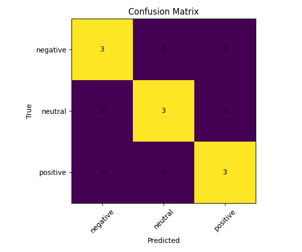

# ML Text Classifier

Python + Machine Learning проект, который:

- обучает модель классификации текстов
- оценивает качество модели
- сохраняет метрики
- строит confusion matrix
- делает предсказания
- автоматически обновляет README через GitHub Actions

## Структура проекта

```text
ml-text-classifier/
│
├── data/
│   ├── dataset.csv
│   └── predictions.csv
│
├── models/
│   └── model.joblib
│
├── reports/
│   ├── metrics.json
│   ├── confusion_matrix.png
│   └── examples.csv
│
├── src/
│   ├── train.py
│   ├── predict.py
│   ├── evaluate.py
│   └── update_readme.py
│
├── .github/
│   └── workflows/
│       └── train.yml
│
├── README.md
├── requirements.txt
└── .gitignore
```
Описание

Модель обучается на CSV-датасете с двумя колонками:
	•	text — текст
	•	label — класс

По умолчанию используется pipeline:
	•	TfidfVectorizer
	•	LogisticRegression

Текущие результаты

Ниже блок будет автоматически обновляться после запуска GitHub Actions.
<!-- METRICS_START -->
## Metrics

- Best Model: **LinearSVC**
- Accuracy: **0.4444**
- Precision (weighted): **0.4444**
- Recall (weighted): **0.4444**
- F1-score (weighted): **0.4444**
- Labels: **negative, neutral, positive**

### Model Comparison

- LogisticRegression: **0.3175**
- MultinomialNB: **0.2167**
- LinearSVC: **0.4444**
<!-- METRICS_END -->
<!-- EXAMPLES_START -->
## Example Predictions

| text | true_label | predicted_label |
| --- | --- | --- |
| Это был худший опыт за последнее время | negative | neutral |
| Очень приятный опыт, спасибо | positive | positive |
| Отличный сервис и быстрая доставка | positive | negative |
| Это сообщение носит информационный характер | neutral | positive |
| Я разочарован этой покупкой | negative | positive |
<!-- EXAMPLES_END -->
<!-- IMAGE_START -->
## Confusion Matrix


<!-- IMAGE_END -->
